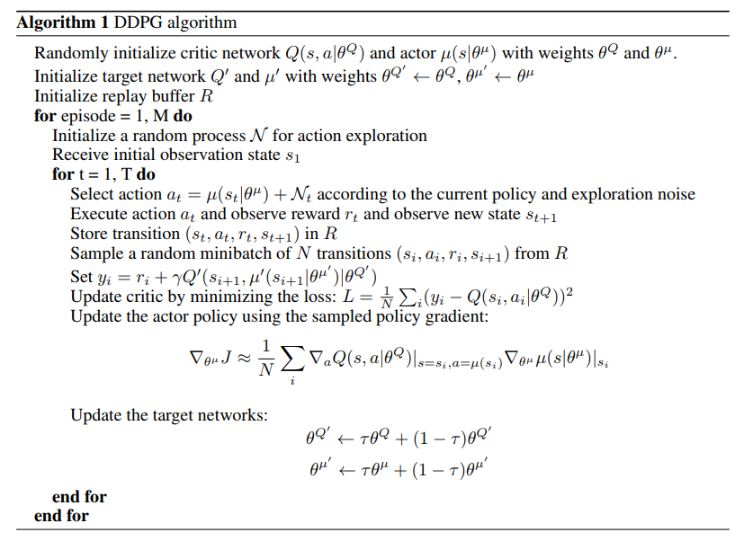
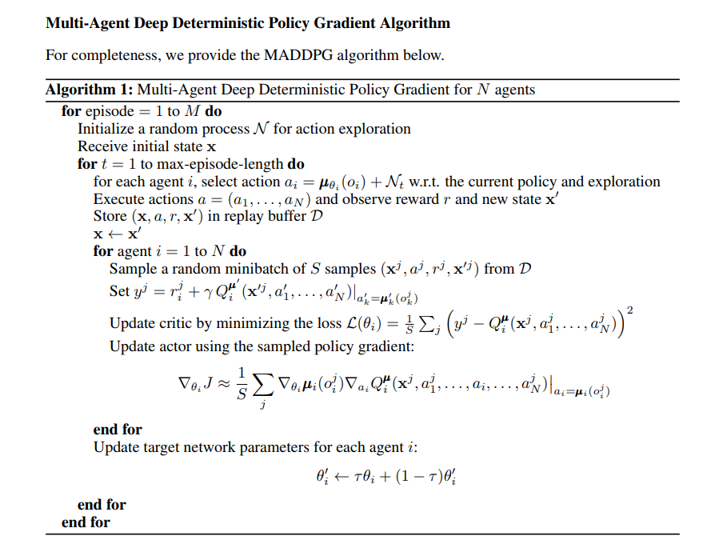
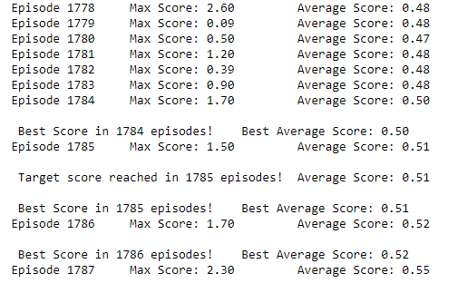
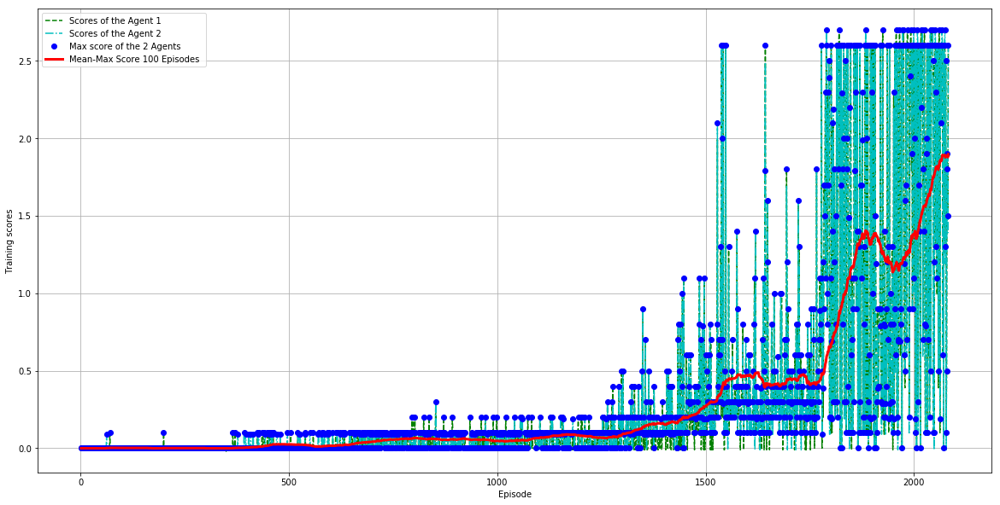
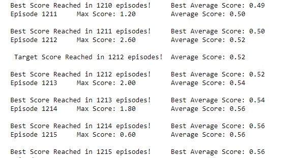
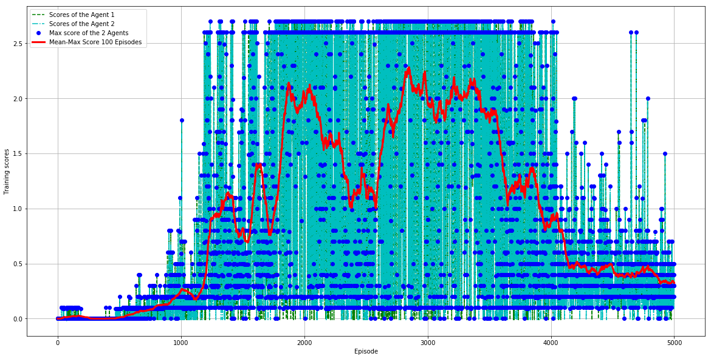

[image1]: https://user-images.githubusercontent.com/10624937/42135623-e770e354-7d12-11e8-998d-29fc74429ca2.gif "Trained Agent"
[image2]: https://user-images.githubusercontent.com/10624937/42135622-e55fb586-7d12-11e8-8a54-3c31da15a90a.gif "Soccer"

# Project 3: Collaboration and Competition

### Introduction

For this project, we work with the Unity [Tennis](https://github.com/Unity-Technologies/ml-agents/blob/master/docs/Learning-Environment-Examples.md#tennis) environment.

![Trained Agent][image1]

In this environment, two agents control rackets to bounce a ball over a net. If an agent hits the ball over the net, it receives a reward of +0.1.  If an agent lets a ball hit the ground or hits the ball out of bounds, it receives a reward of -0.01.  Thus, the goal of each agent is to keep the ball in play.

The observation space consists of 8 variables corresponding to the position and velocity of the ball and racket. Each agent receives its own, local observation.  Two continuous actions are available, corresponding to movement toward (or away from) the net, and jumping. 

The task is episodic, and in order to solve the environment, your agents must get an average score of +0.5 (over 100 consecutive episodes, after taking the maximum over both agents). Specifically,

- After each episode, we add up the rewards that each agent received (without discounting), to get a score for each agent. This yields 2 (potentially different) scores. We then take the maximum of these 2 scores.
- This yields a single **score** for each episode.

The environment is considered solved, when the average (over 100 episodes) of those **scores** is at least +0.5.

## Implementation
For this project, the Multi-Agent Deep Deterministic Policy Gradient (MADDPG) as described in the paper [Multi-Agent Actor-Critic for Mixed Cooperative-Competitive Environments](https://arxiv.org/abs/1706.02275) was implemented. Since MADDPG algorithm is based on [DDPG (Deep Deterministic Policy Gradient)](https://arxiv.org/abs/1509.02971), we will first briefly introduce the DDPG algorithm. 

###  Deep Deterministic Policy Gradient (DDPG)
DDPG is a off-policy "Actor-Critic" method, which includes two deep neural networks,one is called the Actor and the other the Critic, where the Actor is used to approximate the optimal policy deterministically, and the Critic is used to evaluate the optimal action value by using the actor's best believed action. 
In DDPG, we have two copies of the network weights for each of the Actor and Critic networks, a regular and target network for the Actor and a regular and target network for the Critic.

Two interesting aspects of the DDPG are:
  - Experience replay with the replay buffer: Exprience replay helps to break the harmful correlations between expriences and also allows us to learn more from individual tuples multiple times, recall rare occurrences, and in general make better use of our experience.
  
  - Soft Updates: for each time step, we mix 0.01% of regular network weights with the target network weights. The soft update strategy leads to faster convergence in practice and could be applied to any method that uses a target network, includes the DQN.  

The DDPG algorithm is shown below(from the DDPG paper mentioned above):

 
 
###  The Multi-Agent Deep Deterministic Policy Gradient (MADDPG)
As illustrated in the diagram below, the MADDPG method adopts a framework of centralized training with decentralized execution, allowing the policies
to use extra information to ease training, and this extra information is not used at test time.  Specifically, MADDPG learns different DDPG agents for the different actors, but only learns a shared centralized critic network based on the observations and actions of all agents. This method is applicable not only to cooperative but to competitive or mixed cooperative-competitive environments.      
![MADDPG illustration](images/MADDPG_illustration1.png

The algorithm of MADDPG is shown below: 
 
  
### The Python Code
he MADDPG code implemented for this project is based on the DDPG code for the continuous control project. The following are the files:

- model.py: In this Python file, the deep Neural Network models of the actors and the critic are defined.
- mddpg_agent.py: In this Python file, the DQN agent class and a Replay Buffer memory used by the DQN are defined.
- tennis.ipynb: It is the main routine Jupyter notebook file that trains the MADDPG agent, plots the training scores.

#### The MADDPG Parameters 

Most of the parameters of the MADDPG agent remains the same as those in the DDPG agent for the continuous control project. What is diffenrent is that instead of updating the network every time step, the MADDPG agent is updated every 2 time steps. Also, a noise decay factor is used to gradually reduce the weight of the noise added to the actions.        
The MADDPG agent has the following parameter values:
```
BUFFER_SIZE = int(1e6)  # replay buffer size
BATCH_SIZE = 128        # minibatch size
GAMMA = 0.99            # discount factor
TAU = 1e-3              # for soft update of target parameters
LR_ACTOR = 1e-4         # learning rate of the actor 
LR_CRITIC = 1e-4        # learning rate of the critic
WEIGHT_DECAY = 0        # L2 weight decay
UPDATE_EVERY = 2        # Frequency to update the networks (how many time steps to update once)
NOISE_WEIGHT_START = 1.0  # Initial noise weighting factor
NOISE_WEIGHT_DECAY = 0.9999  # Rate of noise weighting factor decay
```

Compared to the DDPG Neural Networks for the continuous control project, both the Actor networks and and critic networks have more layers and a batch normalization layer is also added after the first fully connected layer.

The Actor Neural Networks have 4 fully connected layers and 1 batch normalization layer:

```
The size of input nodes is 24, which is the size of the state
A fully Connected Layer (512 nodes, Relu activation)
A Batch Normalization Layer (512 nodes)
A Fully Connected Layer (256 nodes, Relu activation) 
A Fully Connected Layer (64 nodes, Relu activation) 
A fully connectted layer (2 output nodes, which is the size of the actions, Tanh aciviation for continous actions)
```

The Critic Neural Networks also have 4 fully connected layers and 1 batch normalization layer

```
The size of input nodes is (24+2) * 2 , which is (state size + action size) *2 
A fully Connected Layer (512 nodes, Relu activation)
A Fully Connected Layer (256 nodes, Relu activation)
A Fully Connected Layer (64 nodes, Relu activation) 
A fully connectted layer (1 output node for action value)
```

The Ornstein-Uhlenbeck process has the following parameters:
```
mu = 0 
theta = 0.15
sigma=0.1
```
###  The Results
The agent was run several times with different random seeds. The results of two example runs are shown here.

(1) Example run 1, the target score was reached in 1785 episodes. Here is a screen shot of the trainning score output from `tennis.ipynb` for this run.




In the following plot, the mean score averaged over 100 continuous episodes of maximum scores between the two agents is shown, where the cyan and green dotted lines show the scores of the two agents in each episode, and the blue dots shows the maximum scores of those two agents, and the red line shows the maximum scores averaged over 100 continuous episodes.  
 


The Actors and Critic networks after reaching the target score were saved in the folder `model_saved_run1\`, with the file names `solved_checkpoint_actor1.pth` , `solved_checkpoint_actor2.pth` and `solved_checkpoint_critic.pth`, and the models with the best score during training were saved in the files `bestscore_checkpoint_actor1.pth`, `bestscore_checkpoint_actor2.pth` and `bestscore_checkpoint_critic.pth`.   

(2) Example run 2, the target score was reached in 1212 episodes.  Here is a screen shot of the trainning score output from `tennis.ipynb` for this run.



The training score plot for this run is shown below.
 


The Actors and Critic networks after reaching the target score were saved in the folder `model_saved_run2\`, with the file names `solved_checkpoint_actor1.pth` , `solved_checkpoint_actor2.pth` and `solved_checkpoint_critic.pth`, and the models with the best score during training were saved in the files `bestscore_checkpoint_actor1.pth`, `bestscore_checkpoint_actor2.pth` and `bestscore_checkpoint_critic.pth`.   

### Possible Improvements

There are multiple ways that could potentially improve the performance of the MADDPG architecture:
 -  Further tune the parameters
 -  Use prioritized experience play
  
The following policy based architectures could also potentially increase the performance, which I would like to explore next:

- [PPO](https://arxiv.org/pdf/1707.06347.pdf), Proximal Policy Optimization, a stochastic policy gradient method.
- [A3C](https://arxiv.org/pdf/1602.01783.pdf), an asynchronous gradient descent variant of the actor-critic method.
- [D4PG](https://openreview.net/pdf?id=SyZipzbCb), the distributed distributional deep deterministic policy gradient method. 
